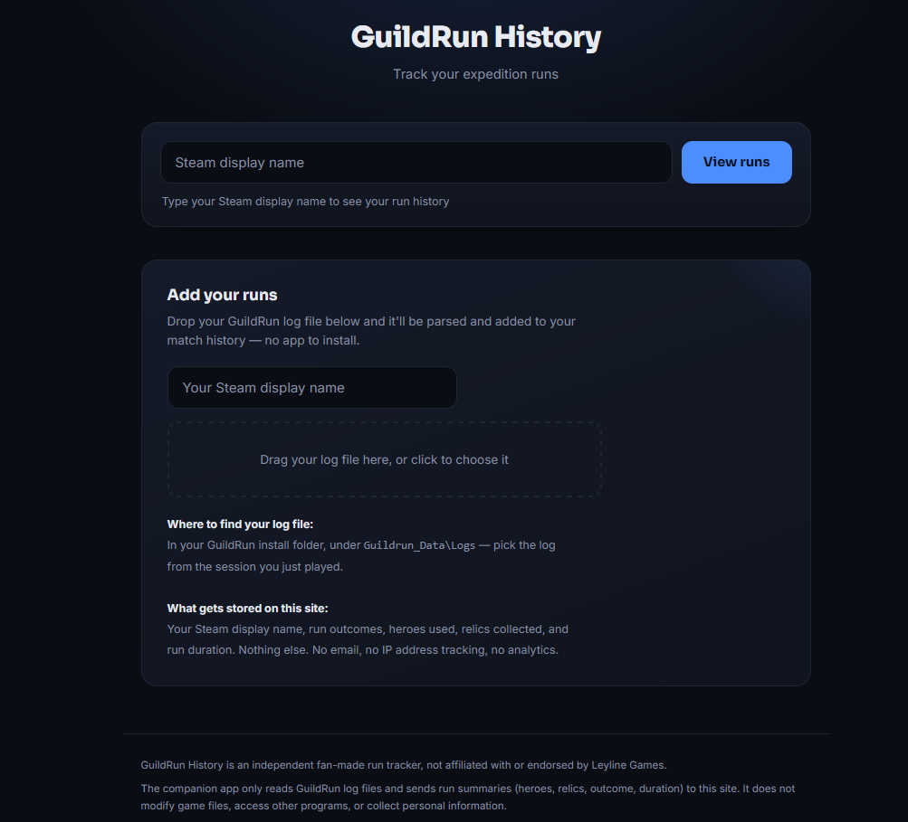
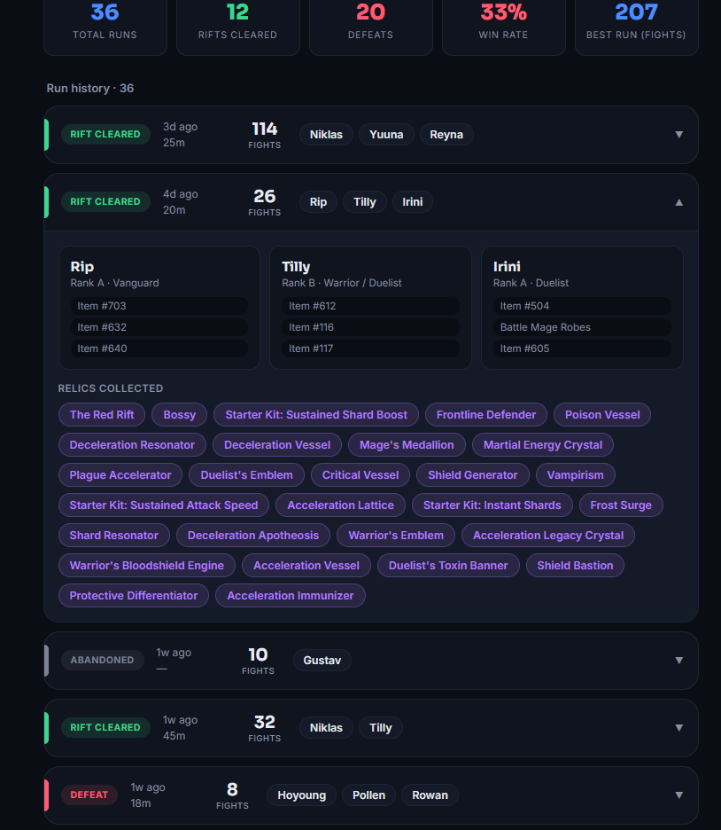

# GuildRun Match History

**A fan-made GuildRun match history tool that parses game log files and builds a searchable expedition history.**

🌐 **Live Website:** https://guildrun-match-history.onrender.com/

## Overview

GuildRun Match History is a fan-made web application created to provide players with a way to keep track of their GuildRun expedition history.

The project was created to solve a simple problem: keeping useful match information accessible in one place when a convenient public match-history API was not available.

Instead of requiring users to install a separate application, the current version uses a browser-based log upload system.

Users can upload their GuildRun log files, which are processed by the application and converted into readable match history information.

## How It Works

The current workflow is:

1. The player locates their GuildRun log files.
2. The player uploads the relevant log file through the website.
3. The server processes the log data.
4. The application extracts the available match information.
5. The resulting history is displayed through the website.

This approach avoids requiring users to download or install additional software.

## Features

* Upload GuildRun log files through the browser.
* Parse match information from uploaded logs.
* Display recorded expedition history.
* Store and retrieve processed match information.
* Provide a simple web interface for viewing match history.

## Technologies

* HTML
* CSS
* JavaScript
* Node.js
* Express
* REST-style server architecture
* Render
* Git / GitHub
* Git LFS

## Development Approach

The project was developed iteratively with the assistance of **Claude**, an AI development tool.

The development process involved describing desired functionality, implementing features, testing the results, identifying problems, and refining the application through multiple iterations.

## Design Decision: Log Upload Instead of a Companion Application

An earlier version of the project explored using a downloadable companion application to collect game data.

After considering the user experience, the approach was changed.

Requiring players to download and run a separate application created unnecessary friction. The current version instead allows users to upload their existing game log files directly through the website.

This resulted in a simpler workflow:

**Game log → Upload → Processing → Match History**

## Challenges & Problem Solving

One of the main challenges was working with game data without relying on a conventional public match-history API.

The project therefore focuses on extracting useful information from locally generated game log files and transforming that information into a format that can be stored and displayed through a web application.

Another consideration was making the process simple enough that users would not need to install additional software.

## Future Improvements

Potential improvements include:

* More detailed match statistics
* Improved log parsing
* Better filtering and searching
* Additional player statistics
* Improved UI and data visualization
* More robust handling of different log formats

## Disclaimer

GuildRun Match History is an independent fan-made project and is not affiliated with or endorsed by the developers of GuildRun.

## Author

**Nicolás Sandes**

GitHub: https://github.com/nicosandes-oss
